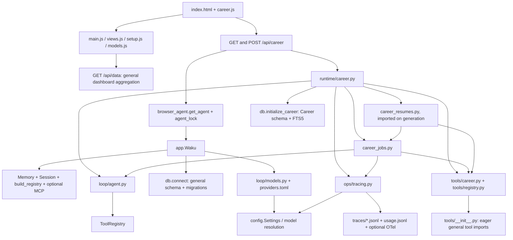
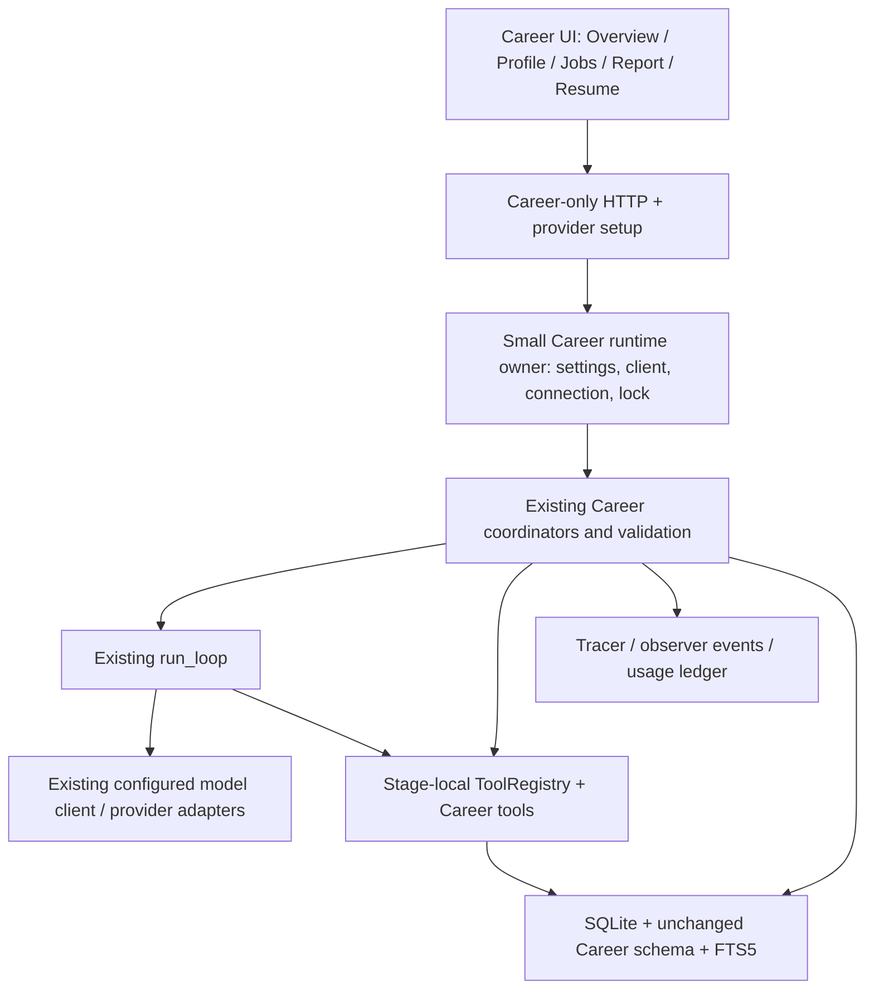

# Career-only productization plan

> This historical document records an earlier project stage. [Current status](../status.md) and [the handoff](HANDOFF.md) describe the retained product.

Career Agent can become the sole product without replacing the existing agent
loop, provider adapters, Career pipeline or database schema. The main work is to
remove general assistant assembly from Career startup, separate provider setup
from integrations, and replace the dashboard shell with Career navigation.

This proposal awaits approval. It authorizes no application changes or deletions.
The audit reflects repository code inspected on 2026-10-06. The original
[Product Spec](PRODUCT_SPEC.md) and [Implementation Plan](IMPLEMENTATION_PLAN.md)
remain historical MVP references. [HANDOFF.md](HANDOFF.md) records prior MVP
verification; its test results are historical, not a fresh verification of this plan.

## 1. Current architecture

Career already has a separate product coordinator. `runtime/career.py` owns
profile persistence, normalization, confirmation and action dispatch.
`runtime/career_jobs.py` owns extraction, evidence matching, scoring and saved
reports. `runtime/career_resumes.py` owns explicit generation, validation and
Markdown output. Paths in this section are relative to `waku/`.

Each AI stage uses fresh messages, a dedicated prompt, a stage-local
`ToolRegistry` and the unchanged `loop/agent.py::run_loop`. Career never calls
`Waku.respond()`. Matching exposes search, evidence lookup and submission;
generation exposes evidence lookup and submission. Normalization and extraction
expose only submission. Stages cap iterations at ten and require valid submission
followed by an assistant completion before publishing results.

Career still enters through `ops/dashboard.py`. Read and non-AI actions open a
connection through `db.connect`; AI actions borrow settings, client and connection
from `ops/browser_agent.py::get_agent`. That function constructs `app.Waku`,
including Memory, general tools, MCP when configured, Session and chat-thread
resolution. These objects are unnecessary for Career execution.

The server imports general integrations, arenas, commands and browser agent
services. Its startup constructs a gateway supervisor and reconciles Telegram,
Discord and WhatsApp. The frontend loads all general scripts, fetches `/api/data`,
restores chat, polls `/api/events`, and defaults to the Waku Overview. Career is
one `#career` view inside that application.

`docs/status.md` describes the upstream assistant and predates the completed
Career work. Actual Career behavior comes from the modules above, not that status
snapshot. The installed dependency list also differs from the rulebook shorthand:
`pyproject.toml` currently includes `python-dotenv` and `rich` alongside the two
provider SDKs. Cleanup must audit actual imports before changing dependencies.

## 2. Career dependency graph



Python executes package initializers even for imports such as
`waku.tools.registry`. `tools/__init__.py` eagerly imports calendar, memory-admin,
messages, notes and search. A Career-only caller therefore still imports general
tool modules even after bypassing `app.Waku`. This must be decoupled before deletion.

## 3. Dependency classification

### KEEP

| Module or artifact | Verified Career purpose |
|---|---|
| `runtime/career.py`, `career_jobs.py`, `career_resumes.py` | These modules implement the complete existing product pipeline and validation. |
| `tools/career.py` | This module supplies literal bounded FTS5 retrieval, active evidence lookup and validated submission factories. |
| `loop/agent.py` | Career calls `run_loop` directly; the loop owns iteration bounds, tool execution, provider calls and observer events. |
| `tools/registry.py` | Career constructs stage-local registries; safe execution returns tool errors for model recovery. |
| `loop/models.py`, `providers.toml` | These files resolve models and endpoints and adapt provider responses to the loop's Messages contract. Keep stable wire adapters and provider scoping. |
| Career SQL in `db.py` | Six tables, external-content FTS5 and three synchronization triggers preserve product artifacts and retrieval. |
| `ops/tracing.py` | Career creates a Tracer per stage, closes success/failure traces and appends permanent token usage. Optional OTel remains an optional tracing capability. |
| `evals/helpers.py`, `evals/career.py`, `evals/fixtures/career_*.json`, four `test_career_*.py` files | These files supply scripted models, acceptance regressions and opt-in real-provider quality evaluation. |
| Shared loop/model/registry/tracing and relevant packaging tests | These tests protect runtime behavior Career still depends on. General Waku names do not make them disposable. |
| MIT notices and applicable third-party notices | Retained upstream code and fonts retain their attribution and license requirements. |

### REFACTOR / DECOUPLE

| Current dependency | Career need and unwanted coupling | Minimal safe strategy |
|---|---|---|
| `dashboard.career_action` → `browser_agent.get_agent` → `app.Waku` | Career needs a configured client, connection and serialized execution; assembly creates memory, sessions, general tools and optional MCP. | Add a small injectable Career runtime owner for settings/client/connection/lock. Call existing coordinators directly. Preserve lazy model creation and failure-safe client replacement. |
| `tools/__init__.py` | Career needs registry and Career factories; package initialization imports unrelated tool implementations. | Make general factory imports local to `build_registry` during transition. Eventually remove that factory after all remaining consumers are retired. Leave registry contracts intact. |
| `db.connect` → `SCHEMA` + `_migrate` | Career needs SQLite rows, busy timeout and compatible threading; connecting initializes and migrates chat/calendar/memory tables. | Separate connection mechanics from schema initialization. Career initializes only `CAREER_SCHEMA`. Keep existing tables untouched in existing files. |
| `config.py::Settings/load_settings/ensure_home` | Career needs provider/model, endpoint and credential overrides, home resolution, bounds and OTel endpoint. General settings include memory, tools, gateways and graph behavior. | Initially retain Settings and existing environment precedence. Remove unused fields and home-file creation only after callers are gone; preserve storage location and provider behavior. |
| `integrations.py` provider functions | Career needs provider readiness, masked status, explicit configuration/probes and endpoint selection. This module imports Notion helpers and includes memory/search/gateway setup. | Extract provider-only services while preserving validation, redaction, rollback, scoped credentials and environment persistence. Replace `browser_agent.rebuild` callbacks with Career runtime reload. |
| `ops/catalog.py`, `settings_api.py`, `ops/catalog` facade callers | Career needs model selection/default resolution. Existing status includes pins, small-model display, Jev, experimental tools and graphs. | Retain provider catalog/default mechanics; expose a narrow provider/model status. Pins are optional UX, not pipeline infrastructure. Remove unrelated status/toggles after setup is replaced. |
| `dashboard.py` HTTP/static infrastructure | Career needs local static serving, JSON actions, errors and serialized stages. Current handler exposes general assistant and arena routes and starts gateways. | Establish a Career-only handler/bootstrap with an explicit route set and no supervisor. Reuse stdlib HTTP and static path-safety logic. Retire old handler in a later stage. |
| `main.js`, `views.js`, `util.js` | Career needs rendering, escaping, controls and navigation; globals also drive general data, chat, diagrams, timers and SQL. | Retain small helpers and create a Career bootstrap/router. Replace shared `D` readiness and `editing` assumptions with explicit Career state. |
| `setup.js`, `models.js` | Career still needs model access; existing screens depend on general dashboard settings/connections and chat refresh. | Keep useful provider form logic behind narrow services; remove the general Connections/Models product pages. |
| `ui.js`, `theme.js`, `style.css` | Career uses cards, buttons, notices, badges, theme, record/report/resume styles and printing; CSS includes rail/chat/arena layouts. | Keep useful functions and Career/accessibility/print rules. Remove styles only after their consumers disappear. Resolve branded styling before shipping the redesigned product. |
| Route/static/design/timer/hosted contract evals | Current tests pin the Waku shell, route list and asset hashes. | Replace obsolete product assertions with Career behavior checks in the same stage that retires the feature. Retain shared guarantees and license boundaries. |

### REMOVE after prerequisites

| Feature or modules | Verified reason and prerequisite |
|---|---|
| `app.Waku`, `runtime/session.py`, conversational `memory/`, SOUL and procedural skills | Career bypasses conversational prompts, memory retrieval and consolidation. Remove product consumers and provider-service Notion imports first. Preserve existing memory files and rows. |
| General tool implementations and `build_registry`, including MCP, calendar, notes, messages, search, Apple, GitHub, workspace, memory-admin and experimental delegation | Career registries contain only Career tools. Remove package initializer and startup dependencies first; preserve `tools/career.py` and `registry.py`. |
| General gateways and supervisor, general CLI commands | Career is a local web product. Replace startup/CLI dispatch and integration callbacks before removing gateways. |
| `graph/` and general workflow commands | Career uses fixed coordinator stages over `run_loop`, without graph execution. Remove dashboard/CLI/config consumers first. |
| Arenas, judgment race, memory comparisons, general telemetry dashboards and comparison-history services | Career evaluation uses `evals/career.py` and stage activity. Remove routes, imports and frontend consumers before deleting these services. |
| General frontend `memory.js`, `render.js`, `diagram.js`, `graph.js`, `compare.js`, `judgment.js`, `dock.js` | Career has its own report/resume renderers and no chat or architecture animation requirement. Stop old bootstrap/global references before unloading scripts. |
| Unrelated product evals, fixtures, extras, bundled skills and generated integration configuration | Retire these only with their product implementation. Keep runtime, Career, security, preservation and packaging checks that still apply. |
| Waku mark, general logos and unused static assets | Career does not need upstream product identity. Verify markup/CSS/provider setup consumers and license obligations before retiring assets. |

“REMOVE” means removal from the eventual code/product surface. It never means
clearing `.waku/`, dropping legacy tables or deleting user configuration.

### UNCERTAIN

| Item | Verification required before physical removal |
|---|---|
| `hosted/`, deployment scripts and their evals/workflows | Career routes are currently blocked by hosted policy, but hosted code consumes Waku command/route/runtime contracts. Decide whether to retire this deployment from the Career repository or preserve it separately. Do not silently break it or move EL2 code into MIT runtime. |
| `examples/`, `lab/`, upstream docs and teaching scripts | Production code cannot import them, but they retain runnable upstream entry points and attribution. Decide archival scope and update references before deleting material. |
| `ops/pricing.py`, release gates and general eval helpers | Career Tracer records tokens without pricing, but evaluation/release workflows may still require these files. Trace their remaining consumers after CI is narrowed. |
| Catalog pins/cache and provider-specific logos | Model-default resolution and provider setup currently use these services/assets. Verify minimal setup behavior before eliminating pin persistence or icons. |
| Existing design tokens, controls, type and fonts CSS | `LICENSE-BRAND` permits unmodified redistribution within a fork but restricts use in another product/service. Confirm intended distribution rights or build independent Career styles. Font files have separate OFL terms. |
| Exact dead-file inventory and external scripts | Python imports alone miss CLI dispatch, JS globals, inline handlers, packaging, shell scripts and hosted contracts. Require a final reference/build/startup audit per deletion batch. |

## 4. Proposed minimal runtime

Career intentionally keeps settings/model access, one client, SQLite connection
management, one execution lock, the loop, Tool/ToolRegistry and tracing. It needs
no general session, conversational memory, MCP, graph engine or gateway supervisor.



The runtime owner is assembly and lifecycle code, not a new framework. Existing
`waku` internal module names can remain. Keep profile/job/resume business rules in
Career modules rather than moving them into generic infrastructure. Prefer small
modules under existing packages over a new top-level runtime package.

Client creation must preserve `get_client` model-default resolution: that function
updates the Settings model fields. Provider changes must build a usable replacement
before retiring the old client and connection. Protect reload and every state
mutation with the execution lock; close owned resources explicitly.

## 5. Career-only backend surface

| Current endpoint | Proposed treatment |
|---|---|
| `GET /api/career` | Keep its profile/evidence/job/resume response contract. |
| `POST /api/career` | Keep `save_onboarding`, `normalize`, `save_profile`, `confirm`, `analyze_job`, `generate_resume`. Preserve validation and explicit generation. |
| `GET /api/models`, `POST /api/providers` | Retain only provider/model setup functions through decoupled services. Keep existing URLs initially to avoid needless API churn. |
| `GET /api/data` | Replace its frontend role with narrow provider/readiness status and `/api/career`. Remove general aggregation after the new shell stops using it. |
| `POST /api/settings`, `/api/pin` | Remove experimental/graph switches. Retain pin/default behavior only if the approved provider UX needs it; provider changes belong in provider setup. |
| `/api/connections`, `/api/connections/test` | Remove general integrations. Migrate any provider-related setup consumers to provider-only services first. |
| `/api/chat`, `/api/chat/stream`, `/api/session`, `/api/voice` | Remove after chat and voice bootstrap consumers are retired. |
| `/api/memory`, `/api/query`, `/api/reveal`, `/api/events` | Remove general memory, SQL, local reveal and animation surfaces. Career activity already arrives in artifacts and needs no event-stream replacement. |
| `/api/graph/stream` | Remove graph execution. |
| `/api/compare/history`, `/api/compare/stream`, `/api/compare/clear`, `/api/compare/regrade`, `/api/compare/delete_run` | Remove model arena services. |
| `/api/memory-arena`, `/api/memory-arena/stores`, `/api/memory-arena/stream`, `/api/memory-arena/clean` | Remove memory arena services. |
| `/api/judgment-arena`, `/api/judgment-arena/key`, `/api/judgment-arena/stream` | Remove judgment arena services. |
| `/`, approved Career hash routes, `/static/…` | Keep the Career shell and used static files. Unknown API paths must return an explicit error rather than the current GET fallback HTML. |

A narrow read-only provider-status endpoint is justified because existing readiness
lives inside `/api/data`; its exact name can be chosen during implementation.
It must expose masked/configured status without returning credentials. It should
report the same resolved provider/model that Career stages use.

Preserve `WAKU_HOME`, existing home resolution, configured provider credentials,
`WAKU_PROVIDER`, `WAKU_MODEL`, endpoint/key overrides, provider-specific endpoints,
`WAKU_LLM_TIMEOUT`, iteration/token bounds and optional OTel configuration.
Keep existing dotenv precedence initially. Do not rename the data folder or move
keys for branding. Remove small-model product controls because Career stages use
one main model, while retaining adapter compatibility where still required.

Preserve loopback binding and static traversal checks. No background provider
calls, integrations or model probes should start merely because a user views Career
artifacts. Explicit setup validation may retain its existing provider probe.
Update dashboard route pins and hosted policy together; Career remains blocked
in hosted access unless a separate hosting proposal changes that decision.

## 6. Career-first frontend

The current shell shows Overview, Gateway, Loop, Graph, Career Agent, Memory,
Tools, Database, Ops, three races, Models, Connections and Behaviour. It also
shows a persistent chat dock, microphone, chat history, model chip, Waku links,
mark and page title. Career should replace this shell, not inherit its rail/dock
layout or four-pillar diagram.

The existing `career.js` implements onboarding, review, confirmed-profile summary,
JD entry, saved jobs, match report, evidence details, language choice, resume,
Markdown export, printing and stage activity. It has in-memory substates rather
than addressable profile/job routes. Its forms support work, project, education
and other records; skills, languages, certifications and research currently live
in record content or other records rather than dedicated schema entities.

| Proposed location | User-facing contents and actions |
|---|---|
| Overview | Show confirmation status, profile summary, recent analyses and Analyze New Job. Route users without a profile to onboarding; show review for unconfirmed normalization. |
| Career Profile | Show original and normalized records, edits and profile-level confirmation. Group education, work, projects, skills and research/certifications/other evidence using existing records. Keep structured heading fields and source IDs. |
| Jobs | List saved jobs, JD Requirement Coverage, MATCH/PARTIAL/GAP counts, failed/outdated states and links to reports. Display counts derived from saved matches. |
| Job Detail | Show pasted JD, extracted summary/responsibilities, requirements, evidence, coverage, strengths, gaps and recommended focus. Offer reanalysis, profile editing, language choice and explicit Generate Tailored Resume. |
| Resume within a job | Show the current draft, evidence inspection, language, Markdown export and print. Keep outdated drafts inspectable and label them clearly. Language changes take effect through explicit regeneration. |
| Provider setup/settings | Offer only provider, model and credentials/endpoint configuration required to run Career. Keep this utility separate from primary product navigation. |

Use simple hash routes such as `#overview`, `#profile`, `#jobs`,
`#jobs/<job-id>` and `#jobs/<job-id>/resume`. Preserve `#career` as a compatibility
entry redirect. Unknown/deleted job IDs need a useful empty state. Browser back,
refresh and direct links must restore saved artifacts without triggering AI work.

Retain plain JavaScript and static serving unless a later approved design proves
that they cannot support this small UI. Reuse escaping, semantic controls, theme,
notices, cards and evidence disclosure patterns. Retain Career form/report/resume
CSS, CJK font fallback and print isolation as behavior, even if visual styles change.
Split utilities away from chat globals and replace `VIEWS` initialization currently
owned by `views.js`. `careerPaint` currently only accepts `#career`; update routing
and rendering together. Unload old scripts only after all inline handlers and
bootstrap references have replacements.

Keep drafts across navigation and refresh activity without rerendering inputs.
The MVP does not persist unsaved drafts across reload; do not silently introduce
a new storage behavior. New navigation must not conceal provider errors or stale
analysis gates. Treat every pasted field and saved artifact as untrusted text.

Branding must say Career Agent in the page title, navigation and startup output.
Remove the Waku mark and product promotion. Preserve ancestry in an About/README
attribution. Reusable MIT UI helper code does not grant rights to the separate
Waku design assets; choose permitted retention or independent Career styling
before implementing the visual redesign. Do not edit copied design files.

## 7. Data preservation requirements

Keep the existing `state.db` path and Career schema. Existing general tables may
remain dormant indefinitely; removing code does not require destructive cleanup.
A new empty runtime should create Career tables without initializing chat/memory.

- Preserve `career_profile.raw_input_json`, `normalized_json`, `user_edits_json`,
  confirmation and timestamps. Confirmation without changes must not recast AI
  wording as explicit user facts.
- Preserve coherent source records and `career-<source_id>` evidence IDs across
  edits. Removed records remain inactive; IDs cannot be reassigned to new facts.
- Preserve evidence raw text, normalized JSON, search text and FTS5 synchronization.
  Do not reinterpret Career Evidence as conversational memory.
- Preserve raw JDs, saved job IDs, requirements, verbatim source excerpts, matches,
  coverage, report/evidence snapshots, activity and timestamps.
- Preserve resume IDs, job association, language, structured content, evidence
  snapshots, outdated flags and Markdown behavior. Successful regeneration still
  replaces one current draft; no version history is introduced.
- Preserve invalidation: factual profile changes clear confirmation and invalidate
  reports/resumes; successful reanalysis leaves old resumes outdated until generation.
- Preserve failure recovery: inputs and previous successful artifacts survive failed
  normalization, analysis or generation. Failed jobs remain available for retry.
- Preserve legacy runtime files, provider configuration, traces and `usage.jsonl`.
  Cleanup must never run demo seeding, wipe runtime state or drop legacy tables.

No schema migration is currently justified. Any later justified change requires
its own compatibility plan and preservation regression before implementation.

## 8. Regression requirements

Keep the complete Career journey:

```text
Onboarding → Normalization → Review/Confirmation → JD Extraction
→ Agent Evidence Retrieval → MATCH/PARTIAL/GAP → Deterministic Coverage
→ Match Report → Explicit Human Action → Grounded Resume
```

Existing profile/job/resume/acceptance evals cover raw preservation, edits,
confirmation, active evidence, synonym searches, injected text, invalid citations,
iteration limits, failure artifacts, stale analysis, generation gates, language,
protected headings/numbers, deterministic scores and terminal tracing. Preserve
those assertions. Adapter tests, registry safety tests and tracing ledger tests
continue to protect the reused runtime.

Add these regressions before retiring their dependencies:

| Gate | Required evidence |
|---|---|
| Career-only imports/startup | Import and construct the Career application with general memory/tools/MCP/gateways unavailable. Verify no subprocess, integration startup or unrelated network call occurs. Use isolated temporary configuration. |
| Runtime lifecycle | Scripted client and injected connection complete the journey; requests serialize; provider replacement cannot race a stage; failed replacement preserves the usable runtime; shutdown closes owned resources. |
| Provider setup | Missing provider produces an actionable error; status agrees with executed model; defaults, regional/custom endpoint scoping, redaction and credential failure behavior survive decoupling. |
| Existing database compatibility | Seed an isolated pre-refactor database with edits, inactive evidence, completed/failed/outdated jobs and resumes. Reopen with Career-only initialization and compare stored values, IDs, FTS results and snapshots. Verify legacy rows remain untouched. |
| HTTP surface | Exercise actual handlers for the closed Career/provider route set. Removed routes must reject requests without mutation, AI calls or HTML fallback. Keep static path-safety and local binding tests. |
| UI journey | Browser checks cover onboarding, grouped profile review, navigation/back/direct links, drafts, repeat submission prevention, provider errors, saved artifact reload, evidence disclosure and explicit generation. |
| Resume output | Verify English/Chinese/Japanese selection and defaults, escaped malicious text, Markdown, both themes, print isolation, CJK headings and stale notices. |
| Packaging and CI | Build/install the remaining package in an isolated environment, start Career, and run tests without retired extras. Reconcile route/static/design/timer/env-example contracts and keep license-boundary checks. |

Coverage must remain `round(100 * sum(weight * value) / sum(weight), 1)`, with
required 2, preferred 1, MATCH 1, PARTIAL 0.5 and GAP 0. Empty requirements return
insufficient information and block generation. The UI must describe coverage as
support from the confirmed profile, never interview or hiring probability.

Existing tests import `build_registry` to prove Career tools are absent from the
general persona and monkeypatch `dashboard.get_agent` to prove client reuse.
Retain their behavioral assertions during transition. Replace their obsolete
assembly seams with Career-only isolation/client-injection assertions when the
general product is retired; do not keep Waku assembly solely to satisfy those tests.

Run focused Career and shared-runtime deterministic checks after each change.
Run the full deterministic suite while general/hosted components remain, then the
approved remaining suite after coherent retirement. Run lint, skill/env validation
where applicable, JavaScript syntax, browser checks and `git diff --check`.
Real-provider evaluation stays explicitly opt-in; offline success cannot establish
semantic grounding or translation quality. Record any live evaluation separately.

## 9. Staged implementation sequence

Each stage ends with a runnable local application and a reviewable commit.

1. **Establish the baseline and Career entry.** Add preservation/startup regression
   fixtures and an explicit Career launch path while leaving the old dashboard
   available for rollback. Keep the historical MVP references unchanged.
2. **Decouple assembly and schema initialization.** Add the small Career runtime
   owner; remove Career calls to `get_agent`; eliminate eager general tool imports;
   preserve connection settings, serialization, tracing and injection seams.
3. **Decouple provider setup.** Extract provider-only services, narrow readiness
   responses and redirect reload callbacks. Verify missing-key and replacement
   failures without constructing Waku. Keep old provider service consumers working
   until the old product is retired.
4. **Replace the frontend shell.** Implement approved Career identity, navigation
   and screens; use only Career/provider APIs. Remove chat/diagram/data polls from
   the new bootstrap. Keep old shell files until the new browser journey passes.
5. **Retire general routes and startup.** Make Career the default application,
   use an explicit route allowlist, remove gateway supervision and reject retired
   API paths. Update hosted policy/route contracts or explicitly retire hosted CI.
6. **Delete proven unused code and assets in bounded batches.** Remove general
   assembly, memory/tools/gateways/graphs and arenas only after import/CLI/JS/build
   consumers disappear. Resolve hosted/teaching archival decisions before deleting
   those trees. Preserve runtime data and all retained-code notices.
7. **Finish configuration, packaging, tests and docs cleanup.** Remove retired
   extras/bundled skills, dead evals and obsolete environment fields. Change
   `uv.lock` only with a justified `pyproject.toml` change. Update README, Career
   guide, architecture/status, command/frontend docs and CI to match the final
   product. Run full remaining regression, installation and browser checks.

Do not combine stages 2–7 into one deletion commit. Before each deletion batch,
trace imports, package initializers, CLI dispatch, shell references, inline JS
handlers, stylesheet/asset references, packaging and CI consumers. A file that
still has a live consumer returns to REFACTOR or UNCERTAIN.

## 10. Risks and rollback

| Risk | Mitigation and rollback |
|---|---|
| Hidden package/global dependencies break startup | Add isolation checks before removal. Retain the old launch path through runtime/UI cutover; revert the specific assembly or script batch if it fails. |
| Provider setup starts general services or loses working configuration | Separate reload ownership and build replacements before swaps. Preserve environment precedence and rollback failed runtime replacement. Never expose keys in snapshots/logs. |
| Data becomes unreachable after a renamed home or schema split | Keep paths/schema unchanged. Compare seeded compatibility artifacts before switching the default launch path. |
| UI loses drafts, job context or generation approval | Run browser regressions before route retirement. Revert the shell/navigation commit without changing saved Career artifacts. |
| FTS triggers, stale behavior or provenance regress | Keep SQL and coordinator rules unchanged; verify IDs, search and artifact snapshots from old databases. |
| Broad deletion weakens regression coverage | Retire tests alongside their product features; preserve shared runtime guarantees and replace obsolete seams with equivalent behavior assertions. |
| Hosted deployment or teaching material breaks | Resolve archival scope explicitly. Keep it out of deletion batches until its lifecycle and license boundaries are decided. |
| Waku styling is reused beyond granted rights | Resolve permissions or use independent Career styles; retain OFL notices for any retained fonts and MIT attribution for reused code. |

Before implementation cutover, take a consistent SQLite backup using the SQLite
backup API or a stopped application, plus copies of configuration and trace/usage
files. Do not copy an actively written database file blindly. Keep backups outside
the active runtime home. Code rollback should normally require only reverting a
stage because this plan changes no schema. Backups support recovery, not routine
replacement of newer user data; any destructive restore requires explicit consent.

## 11. Naming, attribution and non-goals

Career Agent becomes the visible identity. Internal `waku.*` imports, stable
provider identifiers and `WAKU_*` compatibility settings may remain. A wholesale
package/symbol rename creates risk without improving the user journey.

Preserve upstream MIT copyright and attribution. Keep EL2 notices with any
retained `hosted/` code; do not copy that code into the MIT runtime. Retain OFL
notices beside redistributed fonts. `LICENSE-BRAND` governs Waku names, marks and
design files independently of the code license. Record ancestry openly without
presenting Career Agent as endorsed by upstream.

This work adds no AI capability. It does not rewrite stable runtime components,
add embeddings/vector search/GraphRAG, scraping, document uploads, ATS tracking,
autonomous applications, multi-agent execution, cloud deployment, authentication,
payments, resume design systems, DOCX/PDF libraries, version history or new data
entities. It does not purge conversational data or migrate user secrets. It does
not rewrite the historical Product Spec or Implementation Plan.

## Recommended approval phases

Approve three implementation phases, each with a runnable review point:

1. **Runtime separation:** stages 1–3 establish preservation gates, Career-only
   assembly and provider setup while retaining the old product for rollback.
2. **Career product cutover:** stages 4–5 deliver the redesigned UI and closed
   backend surface. Resolve Career visual-asset rights before implementing styles.
3. **Verified retirement:** stages 6–7 remove dead implementation/configuration,
   reconcile CI/docs/packaging and validate the remaining product. Resolve hosted
   and teaching-material scope before their deletion.

Approval of this proposal should name the phase authorized for implementation.
No refactor starts before that approval.
