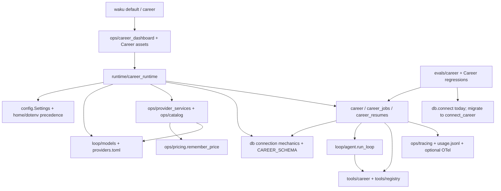

# Phase 3 retirement audit

Career Agent can retire the general Waku product after its remaining hosted,
teaching, test and packaging consumers have been resolved. Career execution
already bypasses the general assistant. Physical deletion has not started.
This audit proposes bounded changes and requires explicit implementation approval.

## 1. Verified post-Phase-2 baseline

The audit inspected clean HEAD `f1a6a75` on 2026-10-06. Runtime separation landed
in `4b3b1e2`; Phase 2 inspection landed in `31292e5`; product cutover landed in
`f1a6a75`. The audit read [HANDOFF.md](HANDOFF.md) before the approved
[refactor plan](CAREER_ONLY_REFACTOR_PLAN.md). The plan's initial architecture
describes the pre-separation state; current code supersedes those descriptions.

| Requirement | Current evidence and result |
|---|---|
| Career launches by default | `waku/__main__.py::main` sends no arguments and `career` to `career_dashboard.main`. `make run` and `make dashboard` use those paths. HTTP evals exercise both dispatches and owned shutdown. |
| Career loads independent assets | `career.html` loads seven `career/*.js` files and `career/style.css`. CSS loads no fonts, images or design imports. The static allowlist contains those eight assets and the shell. Asset evals inspect the loaded graph, handlers, API calls and timer. |
| Career exposes a closed HTTP surface | GET exposes `/api/career`, `/api/provider-status`, `/api/models`, `/` and allowlisted `/static/` files. POST exposes `/api/career` and `/api/providers`. Unknown routes and old assets return JSON 404. Hash routes remain client-side. |
| Career avoids general startup | `CareerRuntime` owns settings, a lazy model client, Career-only connection and lock. The import-isolation regression blocks general modules and completes a synthetic journey. `tools/__init__.py` now imports general implementations only inside `build_registry`. |
| Rollback remains explicit | `waku dashboard` and `make legacy-dashboard` select the old shell; `waku chat` and `make legacy-chat` select terminal chat. Hosted tenants separately launch `waku.ops.dashboard`. |
| Browser regression exists and passes | `test_career_browser.py` runs `career_browser.cjs` against a temporary HTTP server with scripted clients. The fresh Chromium run passed. It covers provider recovery, onboarding, navigation/history, drafts, failures, evidence, explicit generation, export, themes, printing, stale artifacts and reload. It rejects page errors and unrelated requests. |

Fresh verification passed 121 non-browser Career checks and one Chromium journey.
The first restricted run passed 116 checks but could not create sockets. A run
with socket access passed 121 checks but Chromium lacked a library because the
library path omitted `extracted/`. The corrected browser-only run passed.
These environment failures do not indicate a product regression.

The browser invocation used the existing test-only installations:

```bash
WAKU_CAREER_BROWSER=1 \
CAREER_PLAYWRIGHT=/tmp/career-phase1-browser/node_modules/playwright \
PLAYWRIGHT_BROWSERS_PATH=/tmp/career-phase1-browsers \
LD_LIBRARY_PATH=/tmp/career-phase1-browser-libs/extracted/usr/lib/x86_64-linux-gnu \
.venv/bin/python -m pytest -q evals/deterministic/test_career_browser.py
```

The harness redirects provider writes to a temporary dotenv and verifies that the
checkout dotenv bytes remain unchanged. The audit ran no real-provider evaluation,
general assistant launch, seed/reset script, hosted deployment or Docker suite.
Historical broad-suite counts in the handoff are not fresh audit results.

Fresh shared checks passed 220 tests with one skip across models, provider
adapters/errors/endpoints/registry, dotenv/home resolution, trace encoding/viewing,
hosted import boundaries, rulebook and version contracts. This was a focused
selection, not a fresh full deterministic-suite or packaging-build result.

### Discrepancies that constrain retirement

General commands remain reachable beyond the two named rollback paths.
`__main__.py` still dispatches `connections`, `connect`, `voice`, `telegram`,
`discord`, `whatsapp`, `brief`, `gather`, `mcp` and skill installation/export.
Make retains corresponding shortcuts and shootouts. These paths are explicit,
but they are not labelled consistently as legacy. Career default startup remains
correct. Batch A must retire or explicitly defer this complete command surface.

Career evaluation still imports `db.connect`, which initializes general schema.
`evals/career.py` therefore prevents deletion of the general connector today,
although production Career uses `connect_career`. Batch A must change this
evaluation consumer without changing scenarios or Career schema.

Hosted remains a real consumer of the general dashboard and its assets. The
repository contains no approved decision to support hosted Career. Deleting the
old product while leaving hosted builds unchanged would break a retained product.

Git metadata also lists a tracked dotenv backup in the Phase 2 commit. The audit
did not open it or assess its contents. Its retention belongs to a separate
configuration-artifact decision; it is not a product-code deletion candidate.

## 2. Final dependency boundary

Career retains the following dependency chain, including lazy imports:



No Career coordinator imports Session, Memory, MCP, gateways or graph execution.
Package initializers must remain importable after their general factories retire.
Career initializes only its existing schema and FTS5 triggers. Existing legacy
tables, FTS shadow tables, configuration, SOUL files, chat logs, traces and usage
records remain user data even after their implementation retires.

Provider readiness and switching consume catalog defaults and saved pins.
`provider_services` calls `default_model_for`; switching without a model uses the
saved default. Pins are not disposable just because Career lacks a pin editor.
Catalog parsing calls `pricing.remember_price` for priced OpenRouter entries;
`test_explicit_model_catalog_preserves_priced_entries` protects this path.

Career coverage comes from `career_jobs.calculate_match_score`, not
`ops/scoring.py`. Career quality evaluation runs its own stage/judge prompt and
does not call `ops/judge.py` or require DeepEval.

## 3. Retirement inventory and remaining references

REMOVE denotes an eventual removal set after all named consumers retire or move
to an approved archive. It does not mean a file is deletable today. No removal
may bypass the equation: no Career consumer, no retained infrastructure consumer,
and no required packaging, CI, license or documentation consumer.

### KEEP

| Files | Consumer and retained responsibility |
|---|---|
| `runtime/career.py`, `career_jobs.py`, `career_resumes.py`, `career_runtime.py` | Career profile, job, resume, validation, lifecycle and serialization remain unchanged. |
| `tools/career.py` | Career uses bounded literal FTS5 search, active evidence lookup and validated result submission. |
| `ops/career_dashboard.py`, `static/career.html`, `static/career/` | Career uses the HTTP allowlist, provider actions, independent UI and print/export behavior. |
| `evals/career.py`, `fixtures/career_*.json`, `career_browser.cjs`, `career_state.cjs`, every `test_career_*.py` | Career retains scripted acceptance, lifecycle, grounding, scoring, live evaluation plumbing and browser behavior. |
| `README.md`, `docs/career.md`, Career handoff and approved plans | These files explain the product and preserve implementation history. |
| `LICENSE`, applicable notices and release/version contracts | Retained upstream code keeps attribution. Package/version names remain compatible. |

### KEEP AS SHARED INFRASTRUCTURE

| Files or functions | Required treatment |
|---|---|
| `loop/agent.py`, `loop/models.py`, `providers.toml`, `tools/registry.py` | Retain loop bounds, error handling, adapters, provider scoping, response contracts and tool execution. Do not rename them for branding. |
| `config.py` | Retain home resolution, dotenv precedence, provider/model settings, timeout behavior, loop bounds and tracing settings. Narrow only fields whose complete consumers retire. |
| `db.py` connection mechanics, `connect_career`, `initialize_career`, `CAREER_SCHEMA` | Retain threading options, SQLite rows, busy timeout, schema and FTS5. Delete no stored rows or tables. |
| `ops/provider_services.py`, `ops/catalog.py` | Retain masked status, explicit probes, config rollback, candidate environment restoration, model lists and saved default reads. |
| `ops/pricing.py::remember_price` and catalog price fields | Keep the current consumer until a small extraction makes the catalog independent. Full pricing removal has not been proven safe. |
| `ops/tracing.py`, `ops/show_trace.py` | Retain Career JSONL/usage recording and the generic trace viewer. Its `rich` consumer remains live under this recommendation. |
| `evals/helpers.py` scripted blocks/responses/client and `evals/conftest.py` | Retain offline proposals and temporary-home isolation; remove `make_waku` only after all general callers retire. |
| Packaging, static/path/body-bound checks, encoding, provider and rulebook guarantees | Preserve behavior assertions while replacing obsolete product-specific fixtures and imports. |

### REMOVE after complete consumer closure

All paths below are relative to `waku/` unless they begin with another directory.
Each row lists the references that a deletion batch must close.

| Candidate | Remaining references and prerequisite |
|---|---|
| General branches in `__main__.py`; legacy Make targets | CLI imports the gateways, dashboard, connect/integrations, MCP and procedural installers/exporters. Docs and dispatch evals advertise/pin them. Remove commands with coherent error/help and documentation updates; defer hosted's direct module launch separately. |
| `app.py`, `runtime/session.py`, default SOUL construction | Browser agent, gateways, brief/gather, model/memory arenas, `scripts/shootout.py`, eval helpers and general tests consume `Waku`. Hosted uses it through dashboard. Remove only after those consumers leave this supported tree. Never delete users' SOUL files. |
| Conversational `memory/` | Waku/Session, dashboard reads, memory tools, arenas, validators, packaging assertions, examples and lab consume it. `scripts/validate_skills.py` imports procedural `_parse`; wheel packaging force-includes skills. Resolve validator/build and teaching consumers before deleting the tree. |
| `tools/__init__.py::build_registry` | `app.py` and general evals consume this factory. Remove its implementation and obsolete exports while keeping a minimal initializer, `registry.py` and `career.py`. |
| General tools: `apple.py`, `calendar.py`, `google_calendar.py`, `messages.py`, `notes.py`, `search.py`, `github.py`, `memory_admin.py`, `workspace.py`, `experimental.py`, `_env.py` | General registry, dashboard catalog, graph gather, coding eval/delegation and matching tests consume these modules. `_env.py` also serves workspace and coding eval. Close all those consumers together; no Career tool imports these implementations. |
| `tools/mcp_cli.py`, `mcp_client.py`, `mcp_oauth.py`, `waku_memory.py` | General registry, CLI, connect/integrations, MCP fixture/tests and `lab/one-memory-every-agent` consume these files. Hosted templates/config also describe this integration. Resolve teaching/hosted decisions first. |
| `gateway/`, including `runner.py` and `supervisor.py` | CLI and old dashboard start chat, voice and messaging; integrations registers health/reload callbacks. Gateway tests and Make/docs retain them. Career server starts none. Hosted dashboard startup still consumes supervisor. |
| `graph/`, `ops/brief.py`, `ops/gather.py`, `ops/triage.py` | General Waku graph option, dashboard graph stream, CLI/Make, graph tests and teaching docs consume these modules. Graph nodes use retained `run_loop`; that reverse dependency does not require retaining graph. |
| `ops/dashboard.py`, `browser_agent.py`, `commands.py`, `settings_api.py` | Old shell, general routes, terminal commands, hosted tenant command, route policy evals and mixed security/provider/trace tests consume these modules. Migrate retained test assertions and resolve hosted before deletion. |
| `integrations.py`, `connect.py` | General CLI/dashboard, gateway health, calendar health, Notion normalization and `.env.example` generator consume them. Provider operations already live in `provider_services`; retain that module and replace the generator/CI contract before removing the facade. |
| `ops/arena.py`, `memory_arena.py`, `judgment_arena.py`, `judgment_cases.py`, `compare_history.py`, `coding_eval.py`, `scoring.py`, `judge.py` | Old routes/UI, shootout scripts, arena cleaners, datasets and feature-specific tests consume them. Career uses none of these judge/scoring implementations. Hosted policy and route tests still name the blocked arena routes; update those contracts coherently. |
| `ops/release_gate.py` general judge-suite branch | `make gate`, docs and report consumers retain it. Preserve a useful offline release gate and explicit Career live evaluation instructions before removing general judge execution. Do not silently run paid evaluation. |
| `static/index.html`, `static/js/`, `static/style.css` | Dashboard serves them; inline handlers/globals span chat, Memory, Graph, Arena, Judgment, Compare, Models and Connections. Static/JS/timer/design/brand tests pin them; hosted image serves the same shell. `js/career.js` and `career_bootstrap.js` are rollback assets, not the current Career asset graph. |
| `static/logos/`, `static/waku-mark.svg`, bundled `static/fonts/` | Old shell/provider setup/CSS, mark tests, license file globs and packaged assets retain them. Career requests none. Hosted has separate copies which must remain under its lifecycle decision. Retain font notices while any corresponding fonts ship. |
| `skills/` bundled product skills and wheel force-include | General procedural memory, installer/exporter, `validate_skills.py`, skill tests, wheel tests and hosted Docker COPY consume them. Even `interview-prep` is a general assistant skill; the Career pipeline does not load it. Archive community attribution if selected; never delete user-installed skills. |
| `scripts/demo_seed.py`, `shootout.py`, `arena_clean.py` | General demo, Make shootouts, benchmarks and arena cleanup docs/tests retain them. No Career production consumer exists. Audit only inspected source references and did not run reset or cleanup commands. |
| `evals/dataset.jsonl`, `coding.jsonl`, `memory_arena.json`, `fixtures/mcp_demo_server.py`, general judge evals | General scoring/arenas/delegation/MCP and examples consume these fixtures. Retire corresponding tests and teaching references first; retain every Career fixture. |

### ARCHIVE / DOCUMENTATION DECISION

| Material | Evidence, recommendation and runnable limits |
|---|---|
| `examples/tiny_memory_agent.py` | It imports Memory, retrieval gate and general `db.connect`. Archive with a pinned pre-retirement upstream revision; it will not run after those modules disappear. It requires a model/key, so this audit did not execute it. |
| `examples/mcp.demo.json` and README | It needs the MCP fixture/general integration. Its `make dashboard` instruction now launches Career and cannot demonstrate MCP. Recommend an upstream archive with corrected legacy instructions; do not implement the archive now. |
| `lab/one-memory-every-agent/` | Scripts import MCPBridge, Waku Memory URL and procedural exporter. Recommend a pinned upstream archive; retirement would break their imports. |
| `lab/memory-native/` | Native SDK demos do not import Waku runtime, but they need optional services/keys and dated SDK environments. Retain as separately labelled upstream research or archive; do not claim fresh runnable verification. |
| `lab/kimi-k3/`, `lab/pi-agent/`, template and boards | These materials explain upstream providers/agents, benchmarks and teaching context. Recommend an upstream/history archive with attribution and original version context. No Career runtime dependency requires deletion. |
| `scripts/whiteboard/`, `docs/whiteboards/`, architecture boards and `docs/brand/` | Teaching and design provenance justify an archive decision. Builders and doc index retain references. Brand notices continue to apply to retained assets. |

These recommendations do not authorize moving or deleting examples, lab or
history. Production/eval imports run neither from examples nor from lab.
Packaging already excludes those directories; keep that boundary.

### UNCERTAIN

| Item | Unresolved condition |
|---|---|
| `hosted/`, hosted evals/workflow/extra, platform provider contracts | No Career hosting lifecycle decision exists. Retain pending an explicit choice; their dependencies block general-product removal. |
| Full `ops/pricing.py` and catalog pin-writing helpers | Career catalog still records prices and reads defaults. Extract the needed minimum before considering unused aggregation/pin-editing code. |
| `static/design/` and `scripts/sync_design.py` | Career loads none, but repository rules forbid editing copied design files and hosted retains its own copies. Resolve permission for whole-directory retirement explicitly; do not alter token content or copy it into Career. |
| Configuration backups and external invocation of public legacy modules | Repository searches cannot prove external consumers absent. Publish a removed-command/module list and retain a rollback revision. Do not inspect or rewrite credentials as part of retirement. |

## 4. Hosted decision analysis

Hosted is an Elastic License 2.0 deployment of general Waku, not a Career backend.
`hosted/image/tenant.Dockerfile` copies `skills/` and launches
`python -m waku.ops.dashboard`. `hosted/core/policy.py` passes general chat/memory
routes, blocks Career and arena routes, and uses general frontend error contracts.
`test_route_contract.py` imports the old dashboard's pinned route set. Container,
image-context, tenant and hosted Docker evals protect those dependencies.

The safe current classification is UNCERTAIN and deferred. The approved direction
does not establish whether to retire hosted from this fork, retain it against a
pinned upstream checkout, or keep supporting its general product here. This audit
recommends a pinned upstream home for hosted rather than a Career hosting rewrite,
but that recommendation requires a separate decision and preserved notices.

If hosted must remain runnable against this checkout, its general dashboard,
assembly, tools, assets and skill packaging remain consumers. Batches A/B/C
cannot claim complete retirement under that choice. If hosted is separately
preserved or retired by approval, update its build contexts, route contracts,
CI installation and release assumptions together. Do not move any EL2 code into
the MIT runtime. Keep import-boundary and distribution-exclusion tests for as long
as hosted remains in this repository, even if it is archived.

## 5. Configuration cleanup candidates

| Settings/environment group | Consumer closure and proposed treatment |
|---|---|
| `history_turns`, `consolidate_every`, `retrieval_top_k`, `semantic_store`, `episodic_store` | Session/Memory and arenas consume them. Remove after those features and their tests retire. Career FTS5 retrieval has its own bounded tool contract. |
| `apple_calendar`, `google_calendar`, `google_calendar_id`, `apple_tools`, `gh_tool`, `gh_repo`, `experimental`, `graph_workflows` | Registry, integrations, graph, arena and dashboard settings consume them. Remove with the respective feature; delete matching example settings, not users' configuration lines. |
| `telegram_token`, `whatsapp_token`, `whatsapp_phone_number_id`; Discord/voice/webhook variables outside Settings | Gateway and integration code consume them. Search env reads as well as dataclass fields before removing example entries and extras. |
| MCP config, Notion/Supabase/arena credentials, Tavily, Typesafe/Jev and Waku Memory controls | General adapters/integrations/arenas/procedural tools consume them. Retire documentation/generated example entries after hosted and teaching closure. Leave stored files untouched. |
| `disabled_providers` / `WAKU_DISABLED_PROVIDERS` | General settings facade, disable controls and tests consume them. Career readiness/settings do not consult disabled state. Remove after facade retirement; preserve normal provider visibility/scoped credentials. |
| `small_model` / `WAKU_SMALL_MODEL` | CareerRuntime, `models_for`, catalog and provider transactions still read/write it. Keep compatibility initially even though Career stages use only the main model. Narrowing it needs a separate adapter/contract review. |
| `ensure_home` creation of `outbox/` | Messages tools need it; Career startup currently creates it incidentally. Stop creating it only after message consumers retire, while preserving existing directories. |
| Provider overrides, `WAKU_HOME`, model, max iterations/tokens, `WAKU_LLM_TIMEOUT`, OTel and HTTP bind/port | Career and shared infrastructure consume these settings. Keep names, semantics, precedence, loopback default and explicit override warning. |
| `.env.example`, `scripts/generate_env_example.py` | CI generation imports the retired integration registry. Replace it with Career/provider documentation or a minimal provider generator in the same batch as facade removal. |

Do not rename `.waku`, `state.db`, package paths or `WAKU_*` settings. Keep
existing config values harmless when their feature retires; retirement performs
no configuration migration or data cleanup.

## 6. Dependency cleanup candidates

| Dependency/extra | Last inspected consumer and disposition |
|---|---|
| `anthropic`, `openai` | `loop/agent.py` and provider SDK adapters require them. Keep both default dependencies. |
| `python-dotenv` | Config discovery/loading, provider writes/rollback and browser persistence assertions require it. Keep. |
| `rich` | CLI, brief/gather, integration CLI and `ops/show_trace.py` plus its tests require it. Keep under the recommended generic trace-viewer retention. Removal requires an explicit viewer retirement or small replacement first. |
| `[telegram]`, `[discord]`, `[whatsapp]` | Messaging gateways and their install-hint/config tests require python-telegram-bot, discord.py and httpx. Remove extras with gateways after hosted closure. SDKs can still require httpx transitively. |
| `[gcal]` | Google Calendar tools/connect OAuth and OAuth evals require the Google clients/auth packages and httplib2. Remove with those consumers. |
| `[voice]`, `[voice-neural]` | Voice runtime/tests require faster-whisper, sounddevice, numpy, kokoro and soundfile. Remove with voice; do not remove a transitive package merely because the extra disappears. |
| `[supabase]`, `[notion]`, `[arena]` | Conversational stores/arenas use supabase, notion-client, mem0ai, zep-cloud, langmem and langgraph. Teaching demos may retain separate install instructions. Remove product extras only after their production/test consumers retire. |
| `[mcp]` | MCP bridge/CLI/OAuth/fixture tests require mcp. Remove after MCP and teaching consumer decisions. |
| `[eval]` DeepEval | General response/retrieval judge tests and `evals/judge/anthropic_judge.py` use it. Career live evaluation does not. Remove DeepEval after those judge tests and the release-gate branch retire; keep pytest. |
| `[tracing]` | Career Tracer can use OTel SDK/exporter; `make trace` uses Phoenix. Keep this optional capability and its dependencies unless separately narrowed. |
| `[hosted]` | Hosted gateway/proxy/spawner and their evals require aiohttp and PyJWT[crypto]. Defer with hosted; CI/release installs use this extra. |
| `[dev]` and build backend | Pytest, pinned Ruff and pinned Hatchling protect checks/builds. Keep. Playwright/Chromium remain opt-in test tools outside default Python dependencies. |

Refresh `uv.lock` only alongside justified `pyproject.toml` dependency changes.
Do not regenerate it for this audit. Recheck dependency imports across retained
production, tests, tooling and approved archives before each removal.

## 7. Test-suite transition

Every Career test and fixture remains. Provider/model tests remain where they
protect adapters, scoping, defaults, endpoints, errors, lazy initialization and
rollback. Home/dotenv, UTF-8 tracing, version, runtime-data exclusion and packaging
guarantees also remain. Hosted/license tests follow the hosted decision.

Several files mix retained and retired behavior and must be split before removal:

| Current tests/plumbing | Transition |
|---|---|
| `test_tool_trigger.py` | Calendar/dataset assertions retire. Move generic loop iteration/completion/tool-error guarantees to direct `run_loop` with a small synthetic ToolRegistry; do not keep Waku solely for these cases. |
| `test_model_errors.py` | Keep provider and loop error/fallback cases; retire graph-node-specific cases with graph. |
| `test_trace_encoding.py` | Keep Tracer UTF-8 append/refusal cases. Retire general dashboard aggregation/ops-view cases after server retirement. |
| `test_providers.py`, `test_provider_base_urls.py`, `test_pinned_models.py`, `test_platform_provider.py`, `test_provider_disabled.py`, `test_first_run_setup.py`, `test_adopt_first_key.py` | Inspect per-test consumers. Move retained provider transaction/default/scoping assertions to provider services or CareerRuntime; retire general facade/disable/setup UI assertions. Defer platform deployment assertions with hosted. |
| `test_packaging.py`, `test_only_tracked_skills_ship.py`, skill tests | Replace bundled-skill distribution assertions when skill packaging retires. Keep build enumeration, Career assets, isolated installed startup and excluded hosted/lab checks. |
| `test_static_assets.py`, `test_static_js_parses.py`, `test_static_composer.py`, `test_dashboard_background_header.py`, `test_design_system.py`, `test_brand_mark.py`, `test_html_escaping.py` | Retire obsolete shell contracts with shell deletion. Preserve Career asset/handler/timer/browser checks, independent identity/attribution and escaping behavior. Do not delete mixed files wholesale. |
| `test_dashboard_bind.py`, `test_dashboard_routes.py`, hosted route contract | Career bind/static/security checks remain. General route pins retire only after hosted contract resolution. Preserve equivalent negative tests for the closed Career surface. |
| `evals/helpers.py::make_waku`, general judge tests and release gate | Remove the Waku factory after last caller retires. Keep scripted response helpers and temporary homes. Retarget the offline gate and keep live Career eval explicitly opt-in. |

Legacy-only suites retire with their feature: Memory/consolidation/retrieval/
slot/Jev/store conformance, Session/chat/slash/history, graph/workflows,
gateways/voice/wake word, general tools/calendar/workspace/delegation, MCP,
arenas/comparison/coding/shootout, and skill runtime/install/export/triggers.
Tests named `scoring` protect the general dataset scorer; Career scoring lives
in Career job evals and must stay. Classify assertions by consumer, not filename.

The resulting suite must still protect pipeline/provenance, grounding, exact
coverage arithmetic, stage failure recovery, runtime ownership/replacement/
serialization, FTS5 and existing database preservation, provider security,
HTTP/static rejection, browser journey and installed packaging. Any changed
behavior receives an offline regression; new guards must demonstrably fail under
a targeted mutation. Historical fixture initialization may need minimal legacy
SQL in the preservation test after general schema helpers retire.

## 8. Documentation transition

| Documents | Proposed disposition |
|---|---|
| Root README, Career guide/handoff, `docs/architecture.md`, `status.md`, `getting-started.md`, `commands.md`, `evals.md`, `docs/README.md`, `waku/ops/README.md`, static README | Update current instructions to Career and the retained runtime. Remove rollback claims only when those paths retire. |
| `pyproject.toml` description/keywords and CLI comments, Make comments | Replace general assistant/four-pillar product descriptions with Career descriptions while preserving package/version/command compatibility. |
| `docs/context/conventions.md`, `AGENTS.md`, contributing guidance | Replace dead skill/tool/gateway/design routing and CI obligations after their consumers retire. Keep safety, deterministic tests, licensing, writing and process rules. |
| `docs/tour.md`, `integrations.md`, `roadmap.md`, graph designs, loop-vs-graph, memory backend playbook and benchmarks | Recommend labelled upstream/history archives. Update inward links and command examples; do not present removed capabilities as current Career features. |
| Provider registry documentation | Retain and narrow to retained adapters, endpoints, defaults and provider setup. Preserve neutral provider naming. |
| V1 Product Spec/Implementation Plan, refactor plan and Phase 2 inspection | Retain historical scope and decisions. Add current-status links rather than rewriting history as present behavior. |
| Hosted README/deployment docs and brand/font/license notices | Defer lifecycle edits with hosted. Preserve all applicable attribution and license limitations. |

No archive/remove decision for teaching material is implemented by this audit.
Current status also contains old upstream statements that hosted does not yet
exist; actual hosted code disproves them. Correct or label that historical block
when documentation transitions. Preserve authorship and upstream ancestry.

## 9. Proposed deletion batches

Each batch must close its imports, tests, docs and build references together.
The three broad themes are split where extraction or lifecycle decisions require
an independently reviewable boundary.

### Batch A — Remove legacy public entrypoints and close Career coupling

Affected files include `__main__.py`, Makefile, `evals/career.py`, CLI/dispatch
evals, affected command docs and small shared test-helper extractions.
Remove the explicitly approved legacy CLI branches/shortcuts; move Career live
evaluation to `connect_career`. Keep the dedicated Career launch unchanged.
Do not delete `app.py` while old dashboard/hosted still consumes it.

Dependencies: implementation approval must name the command removals. Hosted
continues using its direct dashboard module; teaching instructions must be
labelled or deferred without claiming their old CLI commands still work.

Validation: run all Career evals with Chromium, provider/model and home/config
evals, dispatch negative tests, static security tests, installed wheel startup,
rulebook and relevant hosted route/image contracts. Run lint and diff checks.

Rollback boundary: revert one batch commit; its changes perform no schema or
stored-config migration. Risk: external automation may call removed commands.
Document the removed command list and rollback revision.

### Batch B — Retire general backend and its feature tests

Affected files include `app.py`, Session, Memory, general tools/registry factory,
MCP, gateways/supervisor, graph, integrations/connect, old dashboard/browser
agent/settings/commands, arenas/judge/scoring/coding/comparison modules, scripts,
general fixtures and corresponding tests. Shared extraction retains minimal
initializers, scripted eval helpers, database mechanics and provider behavior.
Remove transitional Career singleton helpers only after dashboard/integrations
are gone; the dedicated server owns its runtime independently.

Dependencies: Batch A plus an explicit hosted lifecycle decision and resolved
teaching/skill-validator/packaging consumers. If hosted stays on this checkout,
defer every backend file it still needs. Backend deletion also needs obsolete
CI skill/env-generator calls removed or replaced in this batch; do not postpone
those dangling imports to Batch C. Keep legacy stored data intact.

Validation: run the entire remaining deterministic suite, Career browser,
provider/runtime/tracing/security checks, skill/env checks if retained, build
enumeration and wheel/sdist install checks. Run hosted contract/Docker checks if
hosted still claims compatibility. Run lint across the remaining supported tree.

Rollback boundary: one coherent commit, or several feature commits each closing
all consumers; a retained pre-retirement revision runs the general product.
Risk: mixed tests hide generic guarantees, package initializers fail, and teaching
or hosted imports survive. A final reference scan must confirm every row closes.

### Batch C — Retire orphan assets and finish configuration/package/docs cleanup

Affected files include the old static shell/JS/CSS/logos/fonts, approved design
directory retirement, obsolete bundled skills and force-include settings, dead
Settings fields, `.env.example`, extras, `uv.lock`, packaging/license metadata,
CI/release commands and documentation links. Keep independent Career assets,
provider defaults, compatible small-model fields and generic tracing/viewer.
Extract catalog price recording before deleting any remaining pricing aggregate.

Dependencies: backend consumer closure from Batch B, approved history/asset
decisions and explicit copied-design retirement permission. Any skill build/CI
closure required by Batch B happens there rather than leaving an intermediate
broken checkout. Refresh the lock only for the extras actually removed.

Validation: run remaining deterministic evals and Chromium, JavaScript syntax,
asset/request allowlists, rulebook/link/license checks, retained config checks,
Ruff, wheel/sdist builds and isolated installed launch/asset/shutdown checks.
Verify packaged manifests omit retired product assets and never include hosted
or lab. Check license expressions against the files actually distributed.

Rollback boundary: revert dependency manifest/lock, metadata and asset changes
as one batch. Risk: notices become inaccurate, a package omits Career assets,
saved defaults change, or a retained document promises a removed command.

## 10. Risks and rollback strategy

Git revisions provide code rollback; user data remains outside retirement.
Do not wipe `.waku`, run demo seeding, clear history/usage, drop legacy tables,
rewrite dotenv files, remove user-installed skills or move credential files.
Every batch tests synthetic temporary homes and existing-database preservation.
Avoid running old and Career applications concurrently against one home because
their locks remain process-local.

Import scans alone cannot prove deletion safety. Check lazy imports, CLI dispatch,
HTTP routes, JS globals/handlers, CSS URLs, Docker COPY/CMD, shell scripts,
fixtures, packaging force-includes, license-file globs and documentation links.
Retest the installed package rather than relying only on checkout imports.

The handoff records an intermittent hosted concurrency failure; this audit did
not rerun or fix it. Do not attribute that historical failure to Career or hide
new failures behind it. OTel's global provider/exporter lifecycle remains a
known shared limitation and is outside retirement scope.

## 11. Explicit non-goals

Phase 3 adds no Career features, AI capabilities, embeddings, vector database,
multi-agent behavior, frontend framework, schema redesign, resume functionality,
authentication, cloud deployment or SaaS infrastructure. It performs no broad
package renaming, branding-driven settings migration or incidental optimization.
It does not erase every Waku name or remove stable shared runtime infrastructure.

## 12. Phase 3 definition of done

Phase 3 finishes only after an approved lifecycle decision resolves hosted and
teaching consumers, and every approved removal closes all repository references.
An intentionally deferred subsystem remains listed with its consumers; deferral
must not be described as completed sole-product retirement.

- Career remains the default installed launch and `waku career` still works.
- Career UI/API expose only the approved surface and use independent assets.
- Career runtime, pipeline, schema, FTS5, provenance and scoring remain compatible.
- Retained shared modules import and execute without retired product assembly.
- Legacy commands/routes/assets/tests/config/extras disappear only with their consumers.
- Temporary-home regressions prove lifecycle, rollback, grounding, security and database preservation.
- Chromium passes and installed wheel/sdist checks serve every Career asset.
- The remaining deterministic suite, lint and applicable CI/build/license checks pass.
- Current docs clearly identify Career as the product and Waku as upstream/runtime ancestry.
- Applicable MIT, EL2, brand and third-party attribution remain accurate.
- Each batch has a reviewable commit and tested code rollback boundary.

Implementation must wait for explicit approval of the bounded batches and their
unresolved lifecycle decisions. This audit authorizes no retirement.
