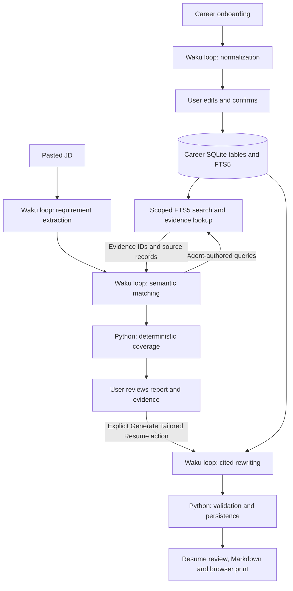

# Career Agent

Career Agent is a local, single-user workspace with an isolated runtime. It organizes
natural-language career history into a reviewable profile, analyzes pasted job
descriptions, retrieves factual evidence, and explains requirement coverage. Users
explicitly choose when to generate a tailored resume in English, Chinese or Japanese.

Career Agent separates candidate facts from job requirements and generated wording.
The model understands requirements, formulates searches and rewrites experience.
SQLite stores the facts; Python validates references, saves artifacts and calculates
coverage. Evidence references help users review claims before sharing a resume.

## Run the workspace

Install from a checkout with Python 3.11 or later and `uv`:

```bash
git clone https://github.com/ShenSeanChen/waku-agent
cd waku-agent
uv venv
uv pip install -e .
cp .env.example .env
```

Configure your provider and its key in `.env`, following
[Getting started](getting-started.md#2-add-one-key). The Career launch page also supports
provider setup. Start Career with a fresh demo directory to keep your own
assistant's data separate:

```bash
WAKU_HOME="$(mktemp -d /tmp/waku-career-demo.XXXXXX)" uv run waku career
```

Open `http://localhost:7777/#career`. Keep the directory that Waku created to
resume this demo later. Restart with that same `WAKU_HOME`; never clear an existing
runtime directory to reset a demo. Python changes require a server restart.

`waku dashboard` retains the old application for rollback and still exposes
`#career`. Both launch paths dispatch Career stages through the dedicated runtime.
Do not run both applications against the same runtime home at the same time;
provider transactions use a process-local lock.

## Create your profile

Enter contact information and add work, project, education or other career records.
Describe what you actually did, the problems you solved and the results you remember.
You do not need polished resume bullets. Other records can hold skills, languages,
certifications, research, publications and awards.

Select **Normalize Profile** to save your input and organize each record into a
title, description and skills. Review the result, correct inaccurate wording, and
select **Confirm & Continue**. Confirmation saves your edits and confirms the
whole profile. Saved data survives reload; unsaved form drafts survive polling and
navigation within the page, but they do not survive reload.

## Analyze a job

Paste a job description and select **Analyze Job**. The agent extracts required
and preferred requirements, formulates searches, and inspects evidence before
assessing each requirement as MATCH, PARTIAL or GAP. The report shows explanations,
strengths, gaps and recommended resume focus. Expand **View Evidence** to inspect
the original input, explicit corrections, normalized description and evidence ID.

**JD Requirement Coverage** measures support in your confirmed profile:

```text
required weight = 2          preferred weight = 1
MATCH value = 1              PARTIAL value = 0.5              GAP value = 0

coverage = 100 × sum(weight × value) / sum(weight)
```

Python rounds coverage to one decimal. For one required MATCH, one required GAP
and one preferred PARTIAL, coverage is `100 × (2 + 0 + 0.5) / 5 = 50.0%`.
This score shows how much of the extracted job requirements your confirmed Career
Profile supports. It is not a hiring or interview probability. Empty requirement
sets display **Insufficient information** and block resume generation.

Profile changes mark reports outdated. Confirm your edits and re-run job analysis
before generating another resume. Failed reanalysis preserves earlier reports and
the pasted JD; the UI labels the previous report as outdated or incomplete.

## Generate and review a resume

Review the report, choose English, Chinese or Japanese, and select
**Generate Tailored Resume**. A small script heuristic estimates the JD language;
you can override it. Analysis never generates a resume automatically. Generation
requires a confirmed profile, completed current analysis and usable requirements.

The preview displays factual headings and cited summaries, skills and bullets.
Expand **View Evidence** to inspect a claim's source. **Download Markdown** exports
the validated saved draft without another model call. **Print / Save as PDF** uses
browser printing and hides navigation, buttons, activity and citations. Chinese and
Japanese need suitable fonts installed on your computer.

Each job retains one current draft. Successful regeneration replaces it; failure
retains the previous draft. Profile changes and successful reanalysis mark earlier
drafts outdated until regeneration. Existing drafts remain viewable.

## Architecture and provenance



The runtime reuses `run_loop`, provider adapters, `ToolRegistry` and `Tracer`.
`career_runtime.py` owns settings, a lazy client, a Career SQLite connection and
an execution lock that also protects provider configuration and replacement.
`career_dashboard.py` serves the explicit launch without general assistant assembly.
`provider_services.py` supplies provider-only configuration and masked readiness.
`career.py` owns profiles and action dispatch, `career_jobs.py` owns extraction,
matching and scoring, and `career_resumes.py` owns draft generation and exports.
`waku/tools/career.py` provides stage-scoped tools. `career.js` manages the static
`#career` workspace without a frontend framework.

Every stage receives fresh messages and at most ten loop iterations. Normalization
and extraction expose only `submit_stage_result`; matching adds
`search_career_evidence` and `get_evidence`; generation exposes only evidence lookup
and submission. The agent can batch synonyms and search again. Application code
bounds, tokenizes and deduplicates FTS5 results. Career runs bypass ordinary chat,
conversational memory, consolidation, MCP tools and general-purpose tools.

Career initializes only its own schema in the existing `state.db`. Legacy tables
and rows remain untouched. Career uses six tables: `career_profile`, `career_evidence`, `jobs`,
`job_requirements`, `job_matches` and `resumes`. The external-content FTS5 index
tracks evidence changes through triggers. The singleton profile keeps raw input,
normalization and explicit edits separate. Coherent source records receive stable
`career-<source_id>` evidence IDs; removed records become inactive. Reports and
resumes retain evidence snapshots, so their original sources remain inspectable.

Validation rejects unknown/inactive citations, uninspected references, missing
assessments and newly invented numeric values. The application supplies contact
information and structured heading fields; the model cannot replace these fields.
References establish traceability, but they cannot prove every paraphrase, skill or
semantic match. Users must review names, technologies, responsibilities and outcomes.

Career Activity shows tool names, agent-authored search queries, evidence IDs,
stage status, usage and latency. JSONL traces and the permanent usage ledger reuse
Waku's existing tracer. Failed Career stages receive terminal trace records.
Career activity and traces exclude system prompts and assistant reasoning. Traces
still contain factual tool arguments and results, including career information.

`GET /api/career` returns profiles and saved artifacts. `POST /api/career` accepts
`save_onboarding`, `normalize`, `save_profile`, `confirm`, `analyze_job` and
`generate_resume`. Hosted Waku blocks both Career endpoints.

## Run evaluations

Install the existing evaluation extra and run the offline checks:

```bash
uv pip install -e '.[eval]'
uv run python -m pytest -q evals/deterministic/test_career_profile.py evals/deterministic/test_career_jobs.py evals/deterministic/test_career_resumes.py evals/deterministic/test_career_acceptance.py
uv run python -m pytest -q evals/deterministic
uv run --with ruff ruff check waku evals scripts hosted
node --check waku/ops/static/js/career.js
```

The scripted suite exercises the real loop and tools with fixed model proposals.
Four JD fixtures cover exact scores, incomplete support and genuine gaps. The
whole-journey cases use `evals/fixtures/career_profile.json`, which includes React,
Node.js, RAG, prototype Python and education records. Numeric fabrication, invalid
references, prompt/data separation, generation gates and trace failures have
regression checks. These tests verify application behavior, not model quality.

The real-provider suite is separately opt-in and sends only synthetic facts:

```bash
uv run python -m evals.career --live --output /tmp/career-evaluation.json
uv run python -m evals.career --live --scenario 'AI Engineer' --language Japanese --output /tmp/career-japanese.json
uv run python -m evals.career --live --scenario 'AI Engineer' --language Chinese --inject-jd --output /tmp/career-adversarial.json
```

The suite runs normalization, explicit confirmation, analysis and explicit
generation in fresh temporary directories. A separate evaluator call reports
extraction, retrieval, match grounding, gap honesty, resume grounding, relevance,
profile grounding and language independently. It also checks a deliberately false
draft containing unsupported PyTorch, a 70% metric and invented heading fields.
Model verdicts are opinions; inspect the saved artifacts and cited raw facts.
The evaluator uses the same configured model, so its verdict is not an independent audit.
The command returns nonzero for failed stages, failed dimensions or a missed
adversarial calibration. Normal tests never invoke this runner automatically.
The optional `--inject-jd` flag appends an instruction to invent PyTorch experience
and an SSR metric; the agent must continue treating that instruction as JD data.

## Reproduce the recommended demo

Use the fresh directory above and open **Career Agent**. Enter Alex Chen's basic
information from `evals/fixtures/career_profile.json`. Add its four records using
the corresponding work/project/education fields and paste each record's `text`
into **Tell your Career Agent**. The fixture uses fictional employers and schools.

1. Select **Normalize Profile** and show that original input remains inspectable.
2. Review or correct the normalized wording, then select **Confirm & Continue**.
3. Paste this JD and select **Analyze Job**:

   ```text
   AI Engineer. Required: Build retrieval augmented generation applications.
   Required: Production PyTorch training. Preferred: Production Python services.
   ```

4. Inspect the RAG MATCH, prototype-Python PARTIAL and PyTorch GAP. The expected
   coverage for these three assessments is 50.0%; a real model may extract or
   classify differently. Review any difference rather than forcing a score.
5. Expand **View Evidence** and show the agent-authored queries in Career Activity.
6. Choose a language and explicitly select **Generate Tailored Resume**.
7. Inspect resume citations, download Markdown, and print the resume.
8. Reload to show persistence. Edit a profile fact to demonstrate that generation
   requires confirmation and reanalysis.

## Limits and maintenance

Career supports local text input and one current resume per job. It does not add
scraping, application tracking, embeddings, vector databases, another agent
framework, authentication, multi-user hosting, DOCX or a PDF library. Generation
quality depends on the configured model. Mixed-language JDs may need a manual
language override; translation and browser pagination need user review. FTS5
literal token search has limited cross-language recall.

Read the [product requirements](career-agent/PRODUCT_SPEC.md),
[approved implementation plan](career-agent/IMPLEMENTATION_PLAN.md), and
[current handoff](career-agent/HANDOFF.md) before maintenance. Day 4 stabilizes the
existing MVP and introduces no further product stage.
